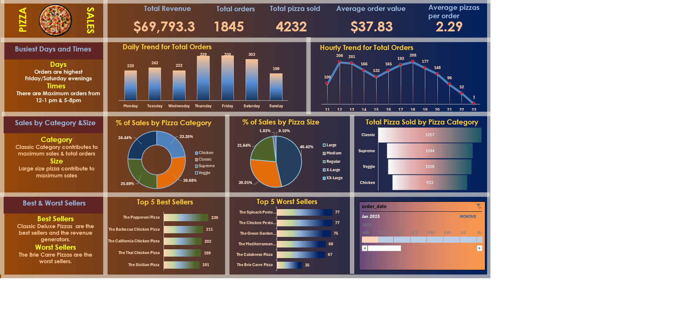

🍕 Pizza Sales Data Analysis Project
📌 Overview
This project focuses on analyzing pizza sales data to uncover key business insights. Using SQL and Excel, the goal is to identify trends, customer preferences, and revenue patterns to support better decision making.
🛠 Tools & Technologies
   MySQL (Data Analysis)
   Microsoft Excel (Dashboard & Visualization)
   PowerPoint (Presentation)
📊 Key Insights
   Highest sales in Classic category
   Peak orders during afternoon hours and evening hours
   Large size pizzas generate maximum revenue
📂 Project Files
    📊 Pizza_sales_dashboard.xlsx → Excel dashboard
    🧠 PIZZA SALES SQL QUERIES.docx → SQL queries with results
    📑 Pizza Sales Data Analysis & Business Insights Project.pptx → Presentation
Dashboard Preiew
    
🚀 Conclusion
This project demonstrates practical skills in SQL, data analysis, and dashboard creation, providing actionable insights for business growth.
